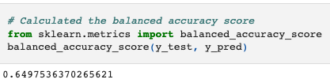
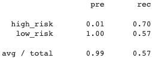

# Credit_Risk_Analysis

For this deliverable, you’ll write a brief summary and analysis of the performance of all the machine learning models used in this Challenge.

The report should contain the following:

Overview of the analysis: Explain the purpose of this analysis.

Results: Using bulleted lists, describe the balanced accuracy scores and the precision and recall scores of all six machine learning models. Use screenshots of your outputs to support your results.

Summary: Summarize the results of the machine learning models, and include a recommendation on the model to use, if any. If you do not recommend any of the models, justify your reasoning.

## Overview

## Results

### Naive Random Oversampling

Balanced Accuracy Score: 64.975%
Low Risk Precision Score: 100%
High Risk Precision Score: 1%
Low Risk Recall Socre: 68%
High Risk Recall Socre: 62%

### SMOTE Oversampling

Balanced Accuracy Score: 64.437%
Low Risk Precision Score: 100%
High Risk Precision Score: 1%
Low Risk Recall Socre: 66%
High Risk Recall Socre: 63%

### Undersampling

Balanced Accuracy Score: 51.608%
Low Risk Precision Score: 100%
High Risk Precision Score: 1%
Low Risk Recall Socre: 43%
High Risk Recall Socre: 60%

### Combination Sampling

Balanced Accuracy Score: 63.761%
Low Risk Precision Score: 1%
High Risk Precision Score: 1%
Low Risk Recall Socre: 57%
High Risk Recall Socre: 70%

### Balanced Random Forest Sampling

Balanced Accuracy Score: 78.777%
Low Risk Precision Score: 100%
High Risk Precision Score: 4%
Low Risk Recall Socre: 91%
High Risk Recall Socre: 67%

### Easy Ensemble Classifier

Balanced Accuracy Score: 92.543%
Low Risk Precision Score: 100%
High Risk Precision Score: 7%
Low Risk Recall Socre: 94%
High Risk Recall Socre: 91%

## Summary